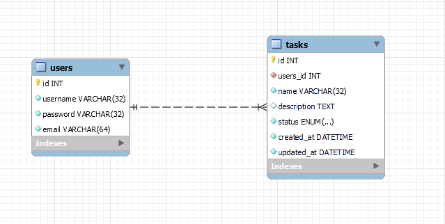
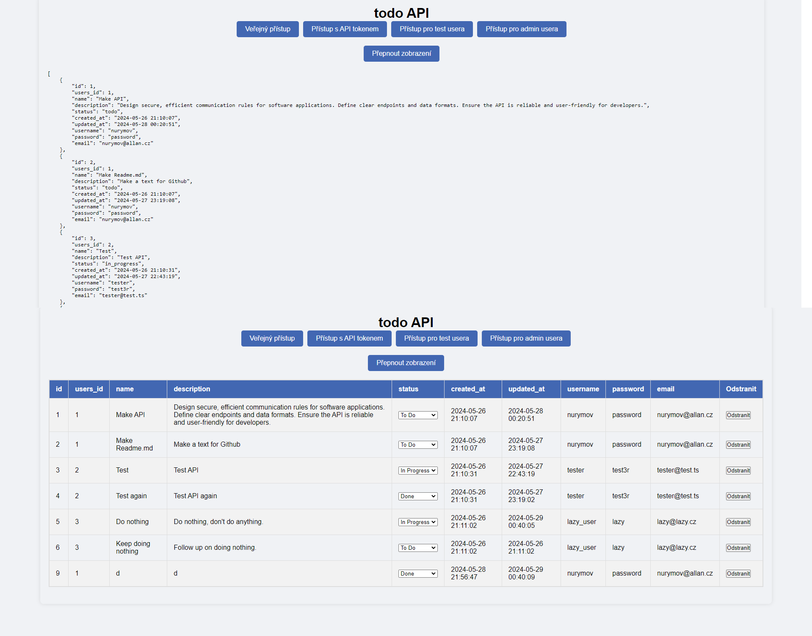

# Todo API Web Interface

Tento projekt je webové rozhraní pro jednoduché Todo API, které umožňuje uživatelům prohlížet, aktualizovat a odstraňovat úkoly.

## Struktura Databáze

V databázi Todo API existují dvě hlavní tabulky: `users` a `tasks`. Tyto tabulky jsou ve vztahu 1:N, což znamená, že každý uživatel může mít více úkolů a každý úkol je přiřazen pouze jednomu uživateli.

### Struktura Tabulek

| Tabulka  |     `users`          |
|------------------|---------------|
| id               | INT(11)       |
| username         | VARCHAR(32)   |
| password         | VARCHAR(32)  |
| email        | VARCHAR(64)  |

| Tabulka  | `tasks`              |
|-----------------|---------------|
| id              | INT(11)       |
| user_id         | INT(11)       |
| name            | VARCHAR(32)  |
| description     | TEXT          |
| status          | ENUM (todo/in_progress/done)          |
| created_at     | DATETIME         |
| updated_at    | DATETIME          |

## Typy Přístupu

Existují různé typy přístupu k Todo API, každý s různými možnostmi a omezeními.

### Veřejný Přístup

Veřejný přístup umožňuje uživatelům prohlížet veřejně dostupné úkoly bez nutnosti přihlášení.

Přehled viditelných sloupců:
- ID
- Name
- Description
- Status

### Přístup s API Tokenem

Přístup s API tokenem vyžaduje, aby uživatel poskytl platný API token pro autentizaci. Tento typ přístupu umožňuje uživatelům prohlížet více informací o úkolech.

Přehled viditelných sloupců:
- ID
- Name
- Description
- Status
- Created_at
- Updated_at
- Username uživatele

Přístup pro testovacího uživatele umožňuje prohlížet, vytvářet, aktualizovat a mazat úkoly, stejně jako přístup s API tokenem. Testovací uživatelé mohou vidět další informace o úkolech, jako jsou ID uživatele, jméno, heslo a e-mail.

Přehled viditelných sloupců:
- ID
- Users_id
- Name
- Description
- Status
- Created_at
- Updated_at
- Username
- Password
- Email

### Přístup pro Administrátora

Přístup pro administrátora umožňuje uživatelům s administrátorskými oprávněními vidět stejné sloupce jako testovací uživatel, navíc ale může aktualizovat status úkolu a může úkol smazat.

## Webová Stránka

Webové rozhraní Todo API je veřejně dostupné na adrese [http://todo.wz.cz/](http://todo.wz.cz/).

## Zobrazení Dat

Uživatelé mohou přepínat zobrazení dat mezi formátem JSON a tabulkou pomocí tlačítka "Přepnout zobrazení". Když je zobrazení nastaveno na JSON, API vrací data ve formátu JSON. Když je zobrazení přepnuto na tabulku, jsou data zobrazena ve formě tabulky pro lepší čitelnost.

